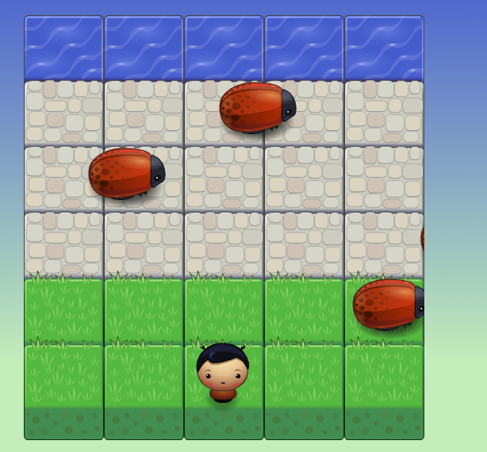

# Frogger!

## Summary
This is a Frogger-styled game, where the player must safely navigate their character to the water. Use the arrow keys to navigate your player. Each time you make it to the water, your score will increase by 1. How many times can you make it?

## Installation
Clone the GitHub repository or download the files as a .zip. No other installations are required.

To load the game, unzip the files or open the file direcotry and open index.html in your web browser.

## Contributions
Contributions to this game are welcome.

## Notes
This game was built as part of Udacity's requirements for the Front End Nanodegree program: www.udacity.com.

This project showcases intermediate javascript skills, Object Oriented Programming and includes several popular 3rd party libraries and plugins including jQuery, animcate.css and Sweet Alert. 

## License
This is licensed under the [MIT License](https://opensource.org/licenses/MIT).